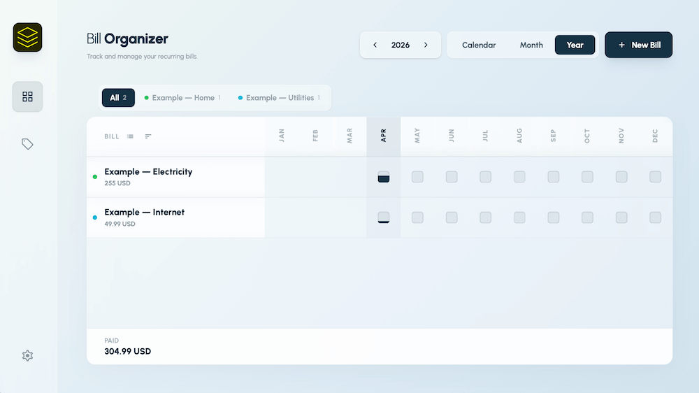
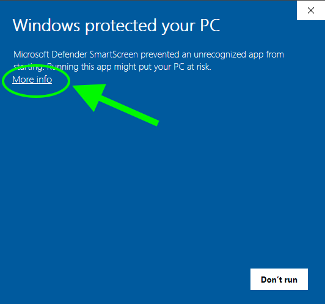
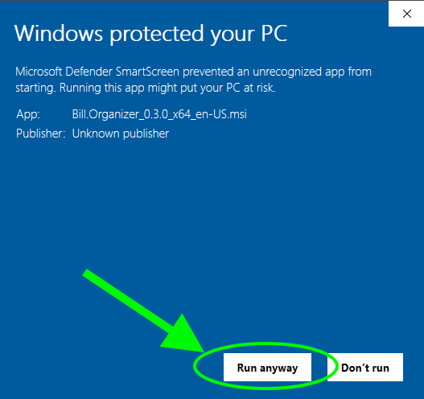

# Bill Organizer

Fast, private, offline-first desktop app for tracking recurring bills and payments.



- [Install](#-install)
  - [Bypassing OS security warnings](#-bypassing-os-security-warnings-)
- [Features](#-features)
  - [Core: bills & payments](#-core-bills--payments)
  - [Views & organization](#-views--organization)
  - [Data & privacy](#-data--privacy)
  - [Look & feel](#-look--feel)
  - [Localization](#-localization)
  - [Platform & delivery](#-platform--delivery)

## 🚀 Install

Download the latest version from the  
👉 [Releases page](https://github.com/dsrrlldr/bill-organizer-releases/releases/latest)

- **macOS (Apple Silicon)** — [`.dmg` (aarch64)](https://github.com/dsrrlldr/bill-organizer-releases/releases/latest/download/Bill.Organizer_0.6.0_aarch64.dmg)
- **macOS (Intel)** — [`.dmg` (x64)](https://github.com/dsrrlldr/bill-organizer-releases/releases/latest/download/Bill.Organizer_0.6.0_x64.dmg)
- **Windows** — [`.msi`](https://github.com/dsrrlldr/bill-organizer-releases/releases/latest/download/Bill.Organizer_0.6.0_x64_en-US.msi) · [`.exe` (NSIS)](https://github.com/dsrrlldr/bill-organizer-releases/releases/latest/download/Bill.Organizer_0.6.0_x64-setup.exe)
- **Linux** — [`.AppImage`](https://github.com/dsrrlldr/bill-organizer-releases/releases/latest/download/Bill.Organizer_0.6.0_amd64.AppImage) · [`.deb`](https://github.com/dsrrlldr/bill-organizer-releases/releases/latest/download/Bill.Organizer_0.6.0_amd64.deb)

If a direct link 404s, grab the matching asset from the [Releases page](https://github.com/dsrrlldr/bill-organizer-releases/releases/latest) (filenames may vary slightly by version).

### ⚠️ Bypassing OS security warnings ⚠️

The app is **not code-signed yet**, so your OS may warn you.  
This is expected and related to distribution costs — not a security issue.

### 🪟 Windows (SmartScreen)

<table>
<tr>
<td>1. Click **More info** on the blue warning dialog.</td>
<td>2. Click **Run anyway**.</td>
</tr>
<tr>
<td></td>
<td></td>
</tr>
</table>

If Microsoft Defender blocks the download itself, open Downloads in your browser and choose **Keep** → **Keep anyway**.

---

### 🍏 macOS

Option A (recommended):
1. Open **Finder** → **Applications**.
2. **Right-click** (or Control-click) **Bill Organizer** → **Open**.
3. Click **Open** in the dialog.

Option B (terminal, if macOS shows "damaged and can't be opened" after download):
```bash
xattr -cr "/Applications/Bill Organizer.app"
```
This removes the quarantine attribute macOS adds to unsigned downloads.

---

### 🐧 Linux
Make the AppImage executable and run it:
```bash
chmod +x BillOrganizer_*.AppImage
./BillOrganizer_*.AppImage
```

---

## ✨ Features

### 💳 Core: Bills & Payments
- **Recurring bills with flexible schedules** — daily, weekly, monthly, or custom N-day intervals; fixed day-of-month; start/end dates; per-bill notes and payment links.
- **Payment history per bill** — amount, currency, date, and comment for every payment.
- **Variable bill amounts over time** — record amount changes with effective dates (utilities that shift month to month) without losing history.
- **Payment sources** — track which card, account, or wallet pays each bill.
- **Multi-currency** — record payments in any currency, add your own codes.

### 📅 Views & Organization
- **Month & Year calendar views** — see every bill, due date, and payment at a glance in a grid (bills × days). Pay, edit, and inspect directly from the cell.
- **Categories with custom colors** — multi-category tagging, color-coded, filterable tabs on the main view.
- **Reminders & desktop notifications** — per-bill reminders with time-of-day and offset-days before the due date, delivered as native system notifications.

### 🔒 Data & Privacy
- **Offline-first, local-only** — all data stays on your machine. No cloud, no account, no login.
- **Multi-device sync via shared folder** — point the app at a Dropbox / iCloud / Syncthing folder and your devices converge automatically. No server involved.
- **Durable history** — every change is recorded as an append-only event, so nothing gets silently overwritten and data stays portable.
- **Custom data directory** — keep your vault wherever you want.

### 🎨 Look & Feel
- **Full dark mode** — per-theme dark palettes, semantic color tokens, instant toggle.
- **17 gradient themes** — pick a palette that matches your desktop.
- **Customizable appearance** — corner radius presets, density (loose / compact), font scaling.

### 🌐 Localization
- **11 languages** — English, Russian, Japanese, Korean, Chinese (Simplified & Traditional), Hindi, Indonesian, Filipino, Turkish, Portuguese (Brazil)

### ⚙️ Platform & Delivery
- **Fast & lightweight** — native desktop performance with a small install footprint.
- **Cross-platform** — macOS (Apple Silicon & Intel), Windows, Linux.
- **Auto-updates** — the app checks for new versions on startup and updates securely.
- **Onboarding walkthrough** — guided first-run tour.
